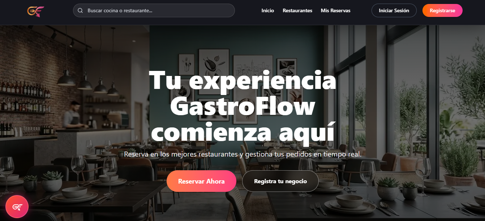
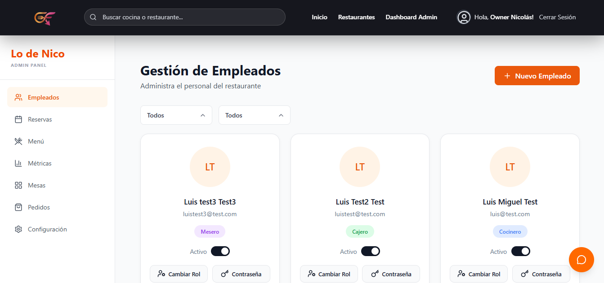

# 👋 Hola, soy Nicolás Malvano

💻 Desarrollador Web Full Stack con especialización en backend  
🚀 Trabajo principalmente con Node.js, TypeScript y NestJS  
🎓 Estudiante de Licenciatura en Sistemas de Información (UNLu)

📍Ubicación: Luján, Buenos Aires  

📧Mail: malvanonicolas@gmail.com  

---

## 🧠 Sobre mí

Soy desarrollador Full Stack con un enfoque fuerte en backend, donde disfruto diseñar APIs robustas, seguras y escalables. Me interesa construir aplicaciones bien estructuradas, aplicando buenas prácticas y pensando siempre en la mantenibilidad del código.

Actualmente enfocado en seguir creciendo profesionalmente mediante el desarrollo de aplicaciones escalables y soluciones orientadas a problemas reales.

Fuera del código, la música es una parte importante de mi vida: toco la guitarra y formé parte de una banda 🎸

---

## 🚀 Proyecto destacado

# 🍽️ GastroFlow

GastroFlow es una plataforma de gestión gastronómica diseñada para digitalizar y optimizar la operación de restaurantes. La aplicación permite a los clientes descubrir restaurantes adheridos, consultar sus menús, realizar reservas online y gestionar pedidos de manera simple e intuitiva.

Por otro lado, los restaurantes que contratan el servicio cuentan con un sistema integral para administrar reservas, mesas, empleados, órdenes y métricas en tiempo real, centralizando toda la operación del negocio en una única plataforma.

El proyecto fue desarrollado en equipo utilizando arquitectura modular y aplicando buenas prácticas tanto en backend como frontend, priorizando la escalabilidad, mantenibilidad y organización del código.

### 🔗 Deploy
👉 [Ver aplicación](https://front-gastroflow.onrender.com/)

### 🔗 Repositorios

- 🖥️ Backend API  
  👉 [gastroflow-api](https://github.com/gastroflow2026-cpu/BACK)

- 🌐 Frontend Web  
  👉 [gastroflow-web](https://github.com/gastroflow2026-cpu/FRONT)

---
## 📸 Preview

---

## 🛠️ Tecnologías

### Backend

### Frontend

### Herramientas e Integraciones

---

## 🎯 Objetivo

Formar parte de un equipo de desarrollo donde pueda crecer profesionalmente, enfrentar nuevos desafíos y seguir construyendo soluciones reales con impacto.
